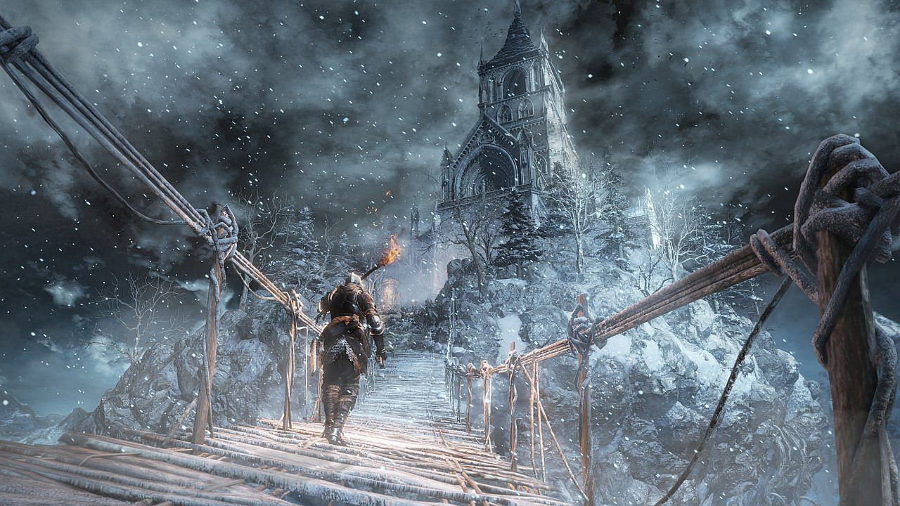
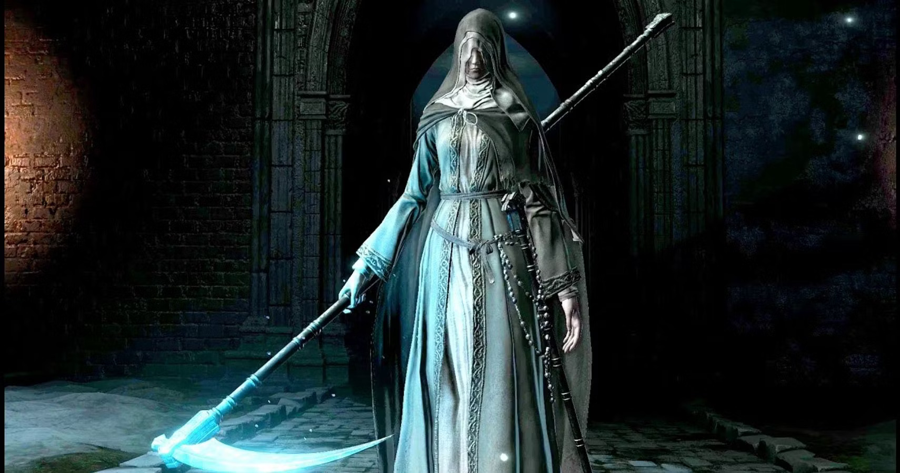
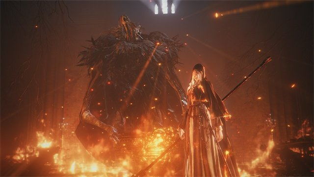

# Im Feenland

## Ankunft

In schön geschmückten Räumen. Großer Tisch in Mitte des größten (mittleren Raumes) mit leeren Tellern.

Frage von Fee: Lieblingsgericht? Alles vorstellbare. Werden in anderem Zimmer magisch zubereitet und anschließend schwebend auf Teller geflogen.

Freund (Brimborium) durch Anomalie nicht hier angekommen. Fee hat keine Kontrolle über Anomalien.

## Herausforderung

Jeder darf 2 Gegenstände für Herausforderung aus Rucksack auswählen. (Gesamter Rucksack mit allen Inhalten wird danach zurückgegeben) Es geht um Leben und Tod.

3 Regeln:
- Versucht auf keinen Fall in 3 Räumen gleichzeitig zu sein. (Wenn 1 Tür geöffnet wird, wird andere verriegelt. Dinge beginnen erst wenn alle in einem Raum sind und Tür hinter einem wird verriegelt)
- Magie ist erlaubt
- Versucht nicht mich auszutricksen.

Magisches Gefühl überkommt alle Abenteurer (fühlt sich nicht wie normale Magie an). Boden unter Füßen verschwindet und alle Abenteurer landen in perfekt eckigem Raum.
Tür öffnet sich zu nächstem Raum. 

Immer 1 Raum --> 2-3 Optionen mit Zeichen über Raum (Herz, Lila Edelstein, Schädel)

### Räume

Zeichen über Türen beschreiben Belohnung (lila Edelstein, Herz), Extra Mini-Schädel falls Mini-Boss oder großer Schädel falls Boss
- Rätsel
- Normale Gegner
- Mini-Boss (Schädel)
- Fähigkeiten Check
- Boss (großer Schädel, nur eine Tür)

### Tod

Alle Räume werden zurückgesetzt und alle außer Boss Räume werden randomized.  
Kleiner Shop taucht in erstem Raum auf. 3 Upgrades werden angeboten, reseten nach Kauf (lila Edelsteine können zusammengelegt werden).  
Kleine Schlange sitzt auf kleinem Tisch. Kann 1 Upgrade entfernen. (Kriecht in Nase und kommt nach 30s wieder aus anderem Nasenloch)  

### Upgrades

Common:

1. Waffe/Spell +1 Schaden
2. Waffe/Spell -1 Geschwindigkeit
3. Geistiger Widerstand +1
4. +1 VTD

Rare:

1. Waffe +3 Schaden
2. Waffe -3 Geschwindigkeit
3. Waffe/Spell +1 Würfel für Waffenfertigkeit/Magieschule

Legendär:

1. 1mal pro Kampf 1 Wurf von Gegner oder Verbündetem reseten
2. 1mal pro Kampf insta-cast
3. Tausch Fokus mit Leben (Max Fokus / 5 Stufen = HP pro Stufe, Fokus = HP*5)
4. Abenteurer erhält doppelten schaden und verteilt doppelten Schaden
5. Magischer Schaden verdoppelt, kein physischer schaden mehr.

Artefakt:
Nur 1mal im kampf einsetzbar, 2 Ticks zum auslösen, in Rätsel- und Fertigkeitsräumen nicht aktiv
1. Kann Zeit stoppen, 4 Aktionen ohne Ticks vorzugehen
2. Schnell bewegen, alle Bewegungsaktionen kosten keine Ticks
3. Gravitation langsam umdrehen (für 5 sec)
4. Nächster Angriff ignoriert VTD (nicht die Raupe)
5. Kann Schwachstellen erkennen und treffen, 1.5 facher Schaden mit allen angriffen (außer Raupe)
6. Erhält 3 Schadensreduktion und kann nicht mehr CCed werden

### Belohnungen

- Normale Gegner:
    - Lila Edelsteine: 3
    - Herz: +3 Leben Für jeden oder 1 Person +9
- Mini-Boss:
    - Lila Edelsteine: 10
    - Herz: +5 Leben Für jeden oder 1 Person +15
- Boss:
    - Lila Edelsteine: 20
    - Herz: Alle heilen voll
    - Artefakt (legendäres Upgrade?)

### Rätsel

Kleine Schlange taucht aus Ritze in Decke auf und setzt sich auf Gegenstand in Raum.
Beschreibt und leitet Rätsel.

- monty hall problem
    > 3 Luken in Decke, 2 Fluten Raum, 1 lila Edelsteine, entscheidet euch für einen.  
    > Boss öffnet eine Luke (Säure geht durch 2. Luke durch Boden) und frägt, ob Abenteurer ihre Wahl ändern wollen.  
    > wenn, ja --> lila Edelsteine und Türen tauchen auf.  
    > wenn, nein --> Säure füllt Raum bis auf Kniehöhe und Türen tauchen auf --> 5W10 Schaden  
    > Erklärung: 1/3 Wahrscheinlichkeit für Preis für jede Tür am Anfang --> andere beiden Optionen sind 2/3 --> 1 Option weggenommen --> 2/3 Chance bleibt für andere Tür --> Wahl ändern ist besser (vorstellen mit 100 Türen)  
- simon says
- Huhn, Fuchs und Sack mit Getreide vielleicht mit Zeitlimit
- Zwei Wächter, einer lügt nur, anderer erzählt nur Wahrheit
- Runen für bestimmte Zauber von allen Abenteurern die in bestimmter Reihenfolge ausgelöst werden müssen
- Knopf aus Stein in Mitte und mysteriösen Symbolen an Wänden (einzelne Zeichen, kein Kontext ausmachbar)
    > Drücke Knopf --> Roter Countdown läuft an Wänden mit magischer Nummer von 10s und piept laut nach jeder Sekunde  
    > Wenn Knopf wieder gedrückt wird --> Countdown reset  
    > Wenn Countdown 0 --> Tür öffnet sich  
- Raum mit Statue in Mitte und 2 Türen + Eingang in 120° Winkel
    > Statue bekommt keinen Schaden, aus unzerstörbarem magischem Material und kann keine debuffs erhalten  
    > greift mit 15 + 2W10 an und macht 2W6 Schaden  
    > wenn man Statue von Richtung einer Tür angreift, öffnet sich die jeweilige Tür  
    > Eingangstür führt in selben gespiegelten Raum falls geöffnet (kann nicht verlassen werden)  
    > anderen beiden Türen führen in neue Räume, falls ein Abenteurer in neuen Raum geht, bewirken angriffe nichts mehr  
    > es ist möglich zur zweiten Tür zu wechseln, oder wieder zurück, falls erste noch nicht betreten wurde  
- Raum mit großem Tresor mit 5 Schlössern und einem Großen Rad zum öffnen
    > neben Schlössern steht entweder "öffnen" oder "schließen" in verschiedenen Sprachen (immer abwechselnd offen, geschlossen, offen, ...)  
    > Sprachen: Farukanisch, Dragoreisch, Vaigro, vierte Sprache  
    > Abenteurer müssen ihre jeweilige Sprache entschlüsseln und die Schlösser entweder aufmachen oder geschlossen lassen  
    > Wenn mit Rad/Kurbel geöffnet wird und richtig --> Belohnung und zwei Türen in Tresor  
    > falls falsch --> 2W10 Schaden für Abenteurer der öffnet  
- Über Ausgangsrichtung ist großes Gesicht mit grüner Zunge, "Gift läuft im Mund zusammen" und streckt Ärmchen nach Gift Flasche in Mitte des Raumes aus
    > Ziel: Gesicht die Flasche reichen --> trinkt Gift, Türen erscheinen  
    > falls Abenteurer die Flasche mit Haut berühren, sind sie gezwungen aus ihr zu trinken 7W4 Schaden  
    > andere Abenteurer können die Flasche entreißen (falls mit Haut --> gleicher Schaden)  

### Normale Gegner

1. Trap Master
    
    - Der raum ist 5x5 grid. Rennt in random Richtung, weg von party.
    - ability: Places a trap on the tile he left. The trap deals 2W10 damage. Runs one tile after 5 ticks.
    - VTD 20
    - 25 HP
    - 1 SR
    - 6 INI
2. Wasser Elementar
    
    - Raum voller Wasser, füllt alten Raum wenn geöffnet. 20cm Luft unter decke. Alle 5 Malus, außer Schwimmen Probe gegen 20.
    - ability: whirlpool um Ziel, 15 gg VTD, 3W6 Schaden. 7 ticks. Bewegt sich während vorbereitung.
    - VTD 22
    - 10 HP
    - 5 SR
    - 4 INI

3. Giant Dwarf
    
    - Großer Zwerg, 3m groß. Riesiger Hammer, Zweihänder.
    - ability: Hammer Erdbeben, 15 gg VTD, 4W10 Schaden, in 3m Radius Umkreis. 10 ticks Verzögerung wenn getroffen. 15 ticks.
    - VTD 20
    - 30 HP
    - 2 SR
    - 2 INI

4. Mammoth
    
    - Mammoth mit 2m langem Stoßzahn. 3m groß.
    - ability: Stoßzahn, 15 gg VTD, 3W10 Schaden. Rennt auf weitest entfernten Abenteurer zu und spießt auf. 10 ticks.
    - VTD 18
    - 40 HP
    - 0 SR
    - 2 INI

5. Imps
    
    - 3 grüne Imps, 50cm groß. Hängen sich an Wände und Decken und springen auf Gesicht.
    - ability: Kratzen mit klauen, 15 gg VTD, 1W6 + 3 Schaden. 5 ticks.
    - VTD 22
    - 5 HP
    - 0 SR
    - 6 INI

### Fähigkeiten Check

1. [ ] Zusammen Brücke bauen
    > Check gegen 25 Handwerk (1 Hauptprobe + 3 Hilfen)
    > Kein Schaden wenn geschafft
    > Abenteurer müssen über Dornen rennen --> 3W10 Schaden für alle
    > Tür ist auf anderer Seite der Dornen

2. [ ] Sehr stabile Kiste mit 3 Vorhängeschlössern
    > Check gegen 30/25(mit 1 Schlüssel)/20(mit 2 Schlüsseln) (Hauptprobe + Hilfe) Schlösser und Fallen oder 30 Stärke + 1W6 von allen
    > Lila Edelsteine in Kiste
    > Tür ist die ganze Zeit auf anderer Seite

### Mini-Bosse

1. Kobold Bombenwerfer
    
    - 2 Kobolde
    - ability: rennen umher und werfen bomben auf Abenteurer, 15 gg VTD, 1W10 + 3 Schaden. 5 ticks.
    - VTD 25
    - 10 HP
    - 2 SR
    - 6 INI

2. Brim
    
    - Brimborium sitzt mit Mantel und Kapuze umgekehrt im Schneidersitz auf dem Boden.
    - ability:
        - reagiert nicht auf Worte, falls er in irgendeiner Weise angegriffen wird, schleudert er mit einer Flammenwelle alle im Umkreis von 5m weg, wirft sie um (+ 5 Ticks) und fügt 2W6 Schaden zu.
        - Feuerstrahl, 25 gg VTD, 3W6 + 4 Schaden, alle 3 Ticks
    - VTD 16
    - 10 HP
    - 2 SR
    - ? INI (Abwartefeld)

### Etagen

#### Erste

6 Räume

#### Zweite

4 Räume

### Erste Etage Boss

Riesige Raupe --> Schmetterling

1. Raupe

    
    - 2m breit in langem 10m breitem Raum. Ist so lange wie der Raum + 2m vor Kopf, kann Kopf nicht drehen, starrer Panzer  
    - ability:
        - Rolle, wenn Abenteurer neben Raupe, trifft immer (außer sie stehen davor), 6W6 Schaden an alle, 15 Ticks
        - kann mit Athletik gg. 25 ausweichen
    - notes:
        - Beine zerstören --> hochklettern und von oben an Kopf Schwachstelle 10HP  
        - Scheint tot zu sein, wirft dann ihren Panzer ab, breitet Flügel aus und beginnt zu fliegen.  
    - 8 Beine mit 18 VTD, Panzer unzerstörbar
    - 8 Beine mit 4HP, Kopf oben 10 HP
    - 1 SR Beine, 0 SR Kopf
    - ? INI (Abwartefeld)

2. Schmetterling
    
    - Vier Flügel, 3m groß
    - ability:
        - wirft mit windstößen 2 Abenteurer um, falls sie zu nahe nebeneinander stehen, + 10 Ticks; alle 15 Ticks.
        - danach direkt Stachel als "Fuß", 20 gg VTD, 4W6 + 3 Schaden, falls jemand in Nähe von angriff ist, wird er derjenige auch umgeworfen.
    - notes:
        - 4 Flügel (2 in 3m Höhe, 2 unten) 10HP 15 VTD, falls erreichbar, pro kaputtem Flügel -5 VTD.
    - 30 VTD
    - 40HP
    - 1 SR
    - ? INI (auf Feld von Raupe)

Braucht deutliche Vereinfachung nach erstem mal (vielleicht das Artefakt)  

Falls geschlagen ohne (viel) HP verloren zu haben --> Erster Raum nach reset führt über Glas Boden über Bossraum (Skip)  

### Final Boss

Vielleicht Friede?  

Schwerster Gegner 2-3 Phasen  

Belohnung: Große Kiste mit 10 Lunaren für jeden (Sind magisch in den Rucksäcken der Abenteurer)  

## Ende

Nach Finalem Boss und Belohnungen werden alle kurz bewusstlos und wachen an dem großen Tisch auf.  
Fee gratuliert den Abenteurern, bietet Essen an und führt sie in anderem Raum durch magisches Portal.  
 --> Ende
