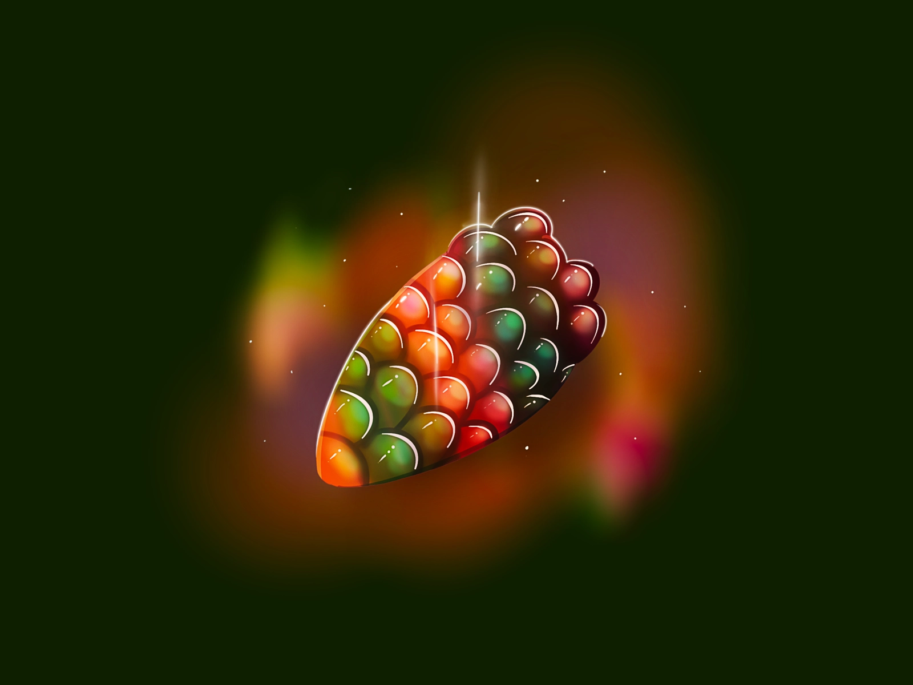

# Im ???

## Start

Brim geht Heim um sich auszuruhen/bleibt daheim.
Restlichen Spieler werden mit Magie bewusstlos geschlagen und in Keller von einem Haus getragen.

Werden an eine "Inception"like magische Traum Maschine angeschlossen. Entführer geht mit ihnen in Traum.
Will das mit Menschen machen, da das menschliche Gehirn besonderer ist als seine eigene Vorstellung.

## Ankunft

In schön geschmückten Räumen. Großer Tisch in Mitte des größten (mittleren Raumes) mit leeren Tellern.

Unbekannter taucht mit Magie aus oranger Rauchwolke auf.

Frage von Unbekanntem: Lieblingsgericht? Alles vorstellbare. Werden in anderem Zimmer magisch zubereitet und anschließend schwebend auf Teller geflogen.

## Herausforderung

Jeder darf 2 Gegenstände für Herausforderung aus Rucksack auswählen. (Gesamter Rucksack mit allen Inhalten wird danach zurückgegeben) Es geht um Leben und Tod.

3 Regeln:
- Versucht auf keinen Fall in 3 Räumen gleichzeitig zu sein. (Wenn 1 Tür geöffnet wird, wird andere verriegelt. Dinge beginnen erst wenn alle in einem Raum sind und Tür hinter einem wird verriegelt)
- Magie ist erlaubt
- Versucht nicht mich zu hintergehen.

Magisches Gefühl überkommt alle Abenteurer (fühlt sich nicht wie normale Magie an). Boden unter Füßen verschwindet und alle Abenteurer landen in perfekt eckigem Raum.
In Shop Raum ist nur eine Tür zu einem Raum mit 2 Türen.(Vorbereitungs Raum)

### Auswahl des Raumes

Immer 2 Optionen mit Zeichen über Raum:

| Beschreibung | Herz | Dunkle Seele  | Tränke | Miniboss |
| ----------- | ----------- | ----------- | ----------- | ----------- |
| Bild |  |  |  |  |
| Würfel | 1-6 | 6-13 | 14-19 | 20 |

### Räume

Zeichen über Türen beschreiben Belohnung (Dunkle Seele, Herz, Tränke), Extra Mini-Schädel falls Mini-Boss oder großer Schädel falls Boss

- normale Räume:
    - Rätsel
    - Normale Gegner
    - Fähigkeiten Check
- Mini-Boss (Schädel)
- Boss (großer Schädel, nur eine Tür)

### Tod

Alle Räume werden zurückgesetzt und alle außer Boss Räume werden randomized.  
Kleiner Shop taucht in erstem Raum auf.
Kleine Schlange sitzt auf kleinem Tisch.

### Tränke

Tränke können in Räumen gefunden werden. Max 2 pro Spieler. 1W6 würfeln.

| Würfel | Trank | Effekt |
|-------|--------|--------|
|1|schwache Heilung|+3 HP|
|2|starke Heilung|+6 HP|
|3|Fähigkeit|+3 auf Fähigkeit die Spieler entscheiden kann|
|4|Verteidigung|+3 Verteidigung|
|5|Geistiger Widerstand|+3 Geistiger Widerstand|
|6|Fokus Wiederherstellung|+6 Fokus|

### Schlange

Kann 1 Upgrade entfernen. (Kriecht in Nase und kommt nach 30s wieder aus anderem Nasenloch)  
Erklärt Rätsel, gibt Hinweise und klärt Fragen.

### Shop Upgrades

Hölzernes Brett mit 3 Upgrades, kein Verkäufer. Items sind in Glaskuppeln mit Magie versiegelt.
3 Upgrades werden angeboten, reseten nach Kauf (Dunkle Seelen können zusammengelegt werden).  
Wenn man genug dunkle Seelen hingehalten werden lösen sie die Glaskuppel auf und Item kann genommen werden.
Erst wird Seltenheitsverteilung mit 1d20 ausgewürfelt. Dann wird Upgrade ausgewürfelt.

**c = common, r = rare, l = legendary**

| Würfel | Seltenheiten |
|-------|--------|
|1-7|c, c, c|
|8-12|c, c, r|
|13-17|c, r, r|
|18-20|c, r, l|

**Kosten in dunklen Seelen:**

| Seltenheit | Kosten |
|-------|--------|
|c|10|
|r|20|
|l|40|

**Common:**

| Würfel | Upgrade | Item | Aussehen |
|-------|--------|--------|--------|
|1|Waffe/Spell +1 Schaden|Pulver das Waffe schärft, Edelstein fließt in Stab der Magie verstärkt||
|2|Waffe/Spell -1 Ticks|Edelstein der in Waffe oder Stab einfließt und Ticks verringert||
|3|Geistiger Widerstand +1| Armreif der Geistigen Widerstand erhöht||
|4|+1 VTD|Schuppe die an Rüstung befestigt werden kann und VTD erhöht||
|5|+2 Fokus|Ring der Fokus erhöht||
|6|+2 HP|kleiner Apfel der HP erhöht||
|7|-1 INI|Adrenalin Syringe die einen schneller kampfbereit macht||
|8|schwacher Heiltrank +3 HP|Trank der HP regeneriert||
|9|schwacher Fokustrank +5 Fokus|Trank der Fokus regeneriert||
|10|Fähigkeitentrank +3 auf Fähigkeit die Spieler in die Flasche flüstern kann|Trank der Fähigkeit regeneriert||

Vielleicht die permanenten Upgrades teurer machen nach bestimmter Zeit, Balance Problem.

**Rare:**

| Würfel | Upgrade | Item | Aussehen |
|-------|--------|--------|--------|
|1|Waffe/Spell +3 Schaden|Pulver das Waffe schärft, Edelstein fließt in Stab der Magie verstärkt||
|2|Waffe/Spell -2 Ticks|Edelstein der in Waffe oder Stab einfließt und Ticks verringert||
|3|Waffe/Spell +1 W6 Würfel für Waffenfertigkeit/Magieschule|magischer Würfel, der aus unerklärlichen Gründen die Waffenfertigkeit/Magieschule mit beeinflust (patzer sind immer noch 2 1/0 !!!).||
|4|Schuppen die auf Rüstung befestigt werden können; +2 VTD + 1SR + 1 Ticks im Kampf|Schuppe die an Rüstung befestigt werden kann und VTD erhöht||
|5|supa Heiltrank +9HP|Trank der HP regeneriert||
|6|supa Fokustrank +15 Fokus|Trank der Fokus regeneriert||

Müssen wahrscheinlich begrenzt werden, da sonst zu stark. 1 von jedem pro Spieler?

**Legendary:**

| Würfel | Upgrade | Item | Aussehen |
|-------|--------|--------|--------|
|1|1mal pro Kampf 1 Wurf von Gegner oder Verbündetem reseten| Stundenglass welches Zeit für ein paar Millisekunden zurücksetzen kann bei Berührung. | |
|2|1mal pro Kampf insta-cast (keine Vorbereitung)|
|3|Tausch Fokus mit Leben (Max Fokus / 5 Stufen = HP pro Stufe, Fokus = HP*5)|
|4|Abenteurer erhält doppelten schaden und verteilt doppelten Schaden|
|5|Magischer Schaden verdoppelt, kein physischer schaden mehr.|
|6|Blutrausch, -2 Schaden, +1 Schaden für jeden Kill, setzt sich auf 0 wenn Schaden genommen wird.|

**Special:**

Als Shop item, oder als Belohnung von Raum.

- Schlüssel für Kisten Challenge (falls noch nicht gemacht) | 2 dunkle Seelen
- Glocke die Gael zur Hilfe ruft | 5 dunkle Seelen

**Artefakte:**
Nur 1mal im kampf einsetzbar, 2 Ticks zum auslösen, in Rätsel- und Fertigkeitsräumen nicht aktiv.
Vermutlich Belohnungen für Minibosse und Bosse.
Sollten beim nächsten Kampf mit dem jeweiligen Boss helfen diesen zu besiegen.

| Würfel | Effekt | Artefakt | Quelle | Aussehen |
|-------|--------|--------|--------|--------|
|1|Kann Zeit stoppen, 1 Aktionen ohne Ticks vorzugehen| Stopuhr | Bombenwerfer Kobolde ||
|2|Schnell bewegen, alle Bewegungsaktionen kosten keine Ticks| Magische Schuhe |Raupe||
|3|Gravitation langsam umdrehen (für 5 sec) kann kurz bisschen fliegen, Gegner sind verwirrt|Magische Schuhe|Schmetterling||
|4|Nächster Angriff ignoriert Großteil VTD (nicht die Raupe)| verfluchter Ring, der die Rüstung des Gegners für einen Angriff durchdringbar macht | Miniboss | |
|5|Kann Schwachstellen erkennen und treffen, 1.5 facher Schaden mit allen angriffen, wenn Check gg. 25 Wahrnehmung| Brille/Visor welches Schwachstellen etwas highlighted | Miniboss | |
|6|Erhält 3 Schadensreduktion und kann nicht mehr CCed werden, -2 bei Bewegungsaktionen/2 Behinderung|Schwere Rüstung, zum überstecken| Miniboss ||

### Belohnungen

Reward Table:

| Raum | Dunkle Seelen | Heilung | Extra |
|-------|--------|--------|--------|
|Normal|5|+3 alle oder +9 einer|-|
|Mini-Boss|15|+5 alle oder +15 einer|-|
|Boss (alle drei)|15|+10 alle|Artefakt|

### Kampf Bewegung

- 2 Ticks = 1 m
- 1 Feld = 1m x 1m
- Spieler muss für Nahkampf in Feld neben Gegner stehen

### Rätsel

Kleine Schlange taucht aus Ritze in Decke auf und setzt sich auf Gegenstand in Raum.
Beschreibt und leitet Rätsel.

- [x] Monty hall problem
    > 3 Luken in Decke, 2 Fluten Raum, 1 Dunkle Seelen, entscheidet euch für einen.  
    > Boss öffnet eine Luke (Säure geht durch 2. Luke durch Boden) und frägt, ob Abenteurer ihre Wahl ändern wollen.  
    > wenn, ja --> Dunkle Seelen und Türen tauchen auf.  
    > wenn, nein --> Säure füllt Raum bis auf Kniehöhe und Türen tauchen auf --> 5W10 Schaden  
    > Erklärung: 1/3 Wahrscheinlichkeit für Preis für jede Tür am Anfang --> andere beiden Optionen sind 2/3 --> 1 Option weggenommen --> 2/3 Chance bleibt für andere Tür --> Wahl ändern ist besser (vorstellen mit 100 Türen, 1 auswählen, dann alle außer 1 werden geöffnet --> diese 1 wurde von 99 gefiltert --> viel wahrscheinlicher dass es der preis ist)

- [x] Raum mit Statue in Mitte und 2 Türen + Eingang in 120° Winkel

    

    > Statue bekommt keinen Schaden, aus unzerstörbarem magischem Material und kann keine debuffs erhalten  
    > greift mit 15 + 2W10 an und macht 2W10 Schaden  
    > wenn man Statue von Richtung einer Tür angreift, öffnet sich die jeweilige Tür  
    > Eingangstür führt in selben gespiegelten Raum falls geöffnet (kann nicht verlassen werden)  
    > anderen beiden Türen führen in neue Räume, falls ein Abenteurer in neuen Raum geht, bewirken angriffe nichts mehr  
    > es ist möglich zur zweiten Tür zu wechseln, oder wieder zurück, falls erste noch nicht betreten wurde  

- [x] Knopf aus Stein in Mitte und mysteriösen Symbolen an Wänden (einzelne Zeichen, kein Kontext ausmachbar)
    > Drücke Knopf --> Roter Countdown läuft an Wänden mit magischer Nummer von 10s und piept laut nach jeder Sekunde  
    > Wenn Knopf wieder gedrückt wird --> Countdown reset  
    > Wenn Countdown 0 --> Tür öffnet sich  

- [x] Es wird Musik (einfache Melodie) gespielt mit 4 verschiedenen Instrumenten (Trompete, Klavier, Violine, Saxophon). Es liegen eine Gitarre und ein Schlagzeug im Raum.
    > Abenteurer müssen die gleiche Melodie auf den 2 Instrumenten im selben Rythmus spielen wie die Instrumente
    > wenn sie es schaffen, öffnet sich die Tür
    > wenn sie es nicht schaffen, 2W10 Schaden für alle Abenteurer

- [ ] Raum mit großem Tresor mit 5 Schlössern und einem Großen Rad zum öffnen
    > neben Schlössern steht entweder "öffnen" oder "schließen" in verschiedenen Sprachen (immer abwechselnd offen, geschlossen, offen, ...)  
    > Sprachen: Farukanisch, Dragoreisch, Vaigro, Basargnomisch, Olelo(kann wschl keiner)
    > Abenteurer müssen ihre jeweilige Sprache entschlüsseln und die Schlösser entweder aufmachen oder geschlossen lassen  
    > Wenn mit Rad/Kurbel geöffnet wird und richtig --> Belohnung und zwei Türen in Tresor  
    > falls falsch --> 2W10 Schaden für Abenteurer der öffnet  

- [ ] Raum mit großem Tresor mit 5 Schlössern und einem Großen Rad zum öffnen
 Über Ausgangsrichtung ist großes Gesicht mit grüner Zunge, "Gift läuft im Mund zusammen" und streckt Ärmchen nach Gift Flasche in Mitte des Raumes aus
    > Ziel: Gesicht die Flasche reichen --> trinkt Gift, Türen erscheinen  
    > falls Abenteurer die Flasche mit Haut berühren, sind sie gezwungen aus ihr zu trinken 7W4 Schaden  
    > andere Abenteurer können die Flasche entreißen (falls mit Haut --> gleicher Schaden)  

- [ ] Heilraum, Quelle mit klarem Wasser. Relativ offensichtlich dass es OK zu trinken ist.
    
    > 20 HP können verteilt werden. Equivalent zur Menge an Wasser.
    > Tür ist direkt offen

- [ ] https://www.brainzilla.com/logic/zebra/einsteins-riddle/
    > 10 min Zeitlimit

- [ ] Zahlenreihe
    > 1,2,4
    > Können 3 mal neue 3x Zahlenreihen eintragen und checken
    > sagt einem ob die Reihe der Regel folgt
    > Regel ist, dass die darauffolgende Zahl größer ist als die vorherige sein muss
    > Haben 3 Versuche die Regel nach der die Reihe aufgebaut ist zu erraten
    > Wenn sie es schaffen, öffnet sich die Tür
    > Wenn sie es nicht schaffen, 2W10 Schaden für alle Abenteurer

- simon says
- Huhn, Fuchs und Sack mit Getreide vielleicht mit Zeitlimit
- Zwei Wächter, einer lügt nur, anderer erzählt nur Wahrheit
- Runen für bestimmte Zauber von allen Abenteurern die in bestimmter Reihenfolge ausgelöst werden müssen

### Normale Gegner

- [x] Trap Master

    

    - Der raum ist Spielfeld grid. Rennt in random Richtung, weg von party.
    - Fähigkeit:
        - Lässt Falle auf Feld von dem er weggeht fallen. 2W10 Schaden. Bewegt sich alle 3 ticks um 2m (2 Felder).
        - Wenn auf Feld mit Spieler, oder durch Feld durch, 15 gg VTD mit Schwert, 2W6 Schaden

    - | HP | VTD | SR | INI |
      |-------|--------|--------|--------|
      | 25 | 20 | 1 | 6 |

- [x] Wasser Elementar

    

    - Raum voller Wasser, füllt alten Raum wenn geöffnet. 20cm Luft unter decke. Alle 5 Malus, außer Schwimmen Probe gegen 20.
    - Fähigkeit: whirlpool um Ziel, 15 gg VTD, 3W6 Schaden. 7 ticks. Bewegt sich während vorbereitung.

    - | HP | VTD | SR | INI |
      |-------|--------|--------|--------|
      | 10 | 22 | 5 | 4 |

- [x] Giant Dwarf

    

    - Großer Zwerg, 3m groß. Riesiger Hammer, Zweihänder.
    - Fähigkeit: Hammer Erdbeben, 15 gg VTD, 4W10 Schaden, in 3m Radius Umkreis. 10 ticks Verzögerung wenn getroffen. 15 ticks.

    - | HP | VTD | SR | INI |
      |-------|--------|--------|--------|
      | 30 | 20 | 2 | 2 |

- [x] Mammoth

    

    - Mammoth mit 2m langem Stoßzahn. 3m groß.
    - Fähigkeit:
        - Stoßzahn, 15 gg VTD, 3W10 Schaden. Rennt auf weitest entfernten Abenteurer zu und spießt auf. 10 ticks.
        - schlägt um sich, 2m umkreis, wirft um, 20 gg VTD, 3W10 schaden, 5 ticks

    - | HP | VTD | SR | INI |
      |-------|--------|--------|--------|
      | 50 | 25 | 0 | 2 |

- [x] Riesenspinne:

    

    - Größe: 1,5m, Waffe: Spinnenfäden und Beißzangen
    - Fähigkeit: Giftige Beißattacke, 15 gg VTD, 2W8 Schaden und Vergiftungseffekt. 10 ticks.
    - | HP | VTD | SR | INI |
      |-------|--------|--------|--------|
      | 20 | 10 | 4 | 4 |

- [x] Untoter Ritter:

    

    - Größe: 2m, Waffe: Schwert und Schild
    - Fähigkeit: Dunkler Schlag, 20 gg VTD, 4W6 Schaden und Dunkeleffekt. 5 Malus auf Kampffähigkeiten wenn getroffen. 15 ticks.
    - | HP | VTD | SR | INI |
      |-------|--------|--------|--------|
      | 25 | 25 | 2 | 2 |

- [x] Wyvern:

    

    - Größe: 4m, Waffe: Klauen und Feueratem
    - Fähigkeit: Feuerstoß, 25 gg VTD, 5W8 Schaden, in einem 3m Radius Umkreis. 8 ticks Verzögerung wenn getroffen. 20 ticks.
    - | HP | VTD | SR | INI |
      |-------|--------|--------|--------|
      | 60 | 26 | 3 | 3 |

- [x] Imps

    

    - 3 grüne Imps, 50cm groß. Hängen sich an Wände und Decken und springen auf Gesicht.
    - Fähigkeit: Kratzen mit klauen, 15 gg VTD, 1W6 + 3 Schaden. 5 ticks.

    - | HP | VTD | SR | INI |
      |-------|--------|--------|--------|
      | 5 | 22 | 0 | 6 |

- [ ] Gargoyle:

    

    - Größe: 2m, Waffe: Klauen und Zähne
    - Fähigkeit: Feuerbreath, 10 gg VTD, 3W6 Schaden, in einem 5m Radius Umkreis. 10 ticks.
    - | HP | VTD | SR | INI |
      |-------|--------|--------|--------|
      | 25 | 15 | 3 | 3 |

- [x] Goblin:

    

    - Größe: 1.5m, Waffe: big hammer
    - Fähigkeit: Hammer Wirbel , 17 gg VTD, 2W10 Schaden, in einer Aktion in einer 6m Reihe mit 2m radius allen Schaden, 15 ticks.
    - | HP | VTD | SR | INI |
      |-------|--------|--------|--------|
      | 60 | 24 | 3 | 5 |

- [ ] Mimic Chest (dark souls):
    
    

    - Größe: 1.5m, Waffe: Klauen und Zähne
    - Fähigkeit: Grab, 15 gg VTD/2, 5W6 Schaden (mehrere Bisse), 10 ticks.
    - | HP | VTD | SR | INI |
      |-------|--------|--------|--------|
      | 40 | 25 | 3 | ? |

- [ ] Giftiger Dämon:
  - Größe: 1,5m, Waffe: Giftige Klauen
    - Fähigkeit: Giftiger Biss, 25 gg VTD, 3W8 Schaden und Giftstatus. 10 ticks Verzögerung wenn getroffen. 15 ticks.
    - | HP | VTD | SR | INI |
      |-------|--------|--------|--------|
      | 20 | 20 | 2 | 3 |

- [ ] Feuerdrache:
  - Größe: 4m, Waffe: Feueratem
    - Fähigkeit: Feuerstoß, 30 gg VTD, 6W6 Schaden und Feuerstatus. 15 ticks Verzögerung wenn getroffen. 20 ticks.
    - | HP | VTD | SR | INI |
      |-------|--------|--------|--------|
      | 20 | 25 | 4 | 4 |

- [ ] Eiszauberin:
  - Größe: 1,7m, Waffe: Eisstab
    - Fähigkeit: Eisblitz, 25 gg VTD, 4W6 Schaden und Eisstatus. 10 ticks Verzögerung wenn getroffen. 15 ticks.
    - | HP | VTD | SR | INI |
      |-------|--------|--------|--------|
      | 15 | 25 | 1 | 3 |

- [ ] Blitzdämon:
  - Größe: 2m, Waffe: Blitzschwert
    - Fähigkeit: Blitzschlag, 20 gg VTD, 5W6 Schaden und Blitzstatus. 5 ticks Verzögerung wenn getroffen. 10 ticks.
    - | HP | VTD | SR | INI |
      |-------|--------|--------|--------|
      | 20 | 25 | 2 | 3 |

### Fähigkeiten Checks

Juvius: Akrobatik, Darbietung, Redegewandtheit
Dalyan: Zähigkeit, Arkane Kunde, Athletik
Caressa: Überleben, Arkane Kunde, Heimlichkeit, Geschichten und Mythen
Tamme: Diplomatie, Redegewandtheit, Städtekunde, Länderkunde, Seefahrt, Darbietung

**Offenbart sich nur wenn unbedingt nötig:**
Kann in jedem Raum alternativ Hand in Wand stecken um Hebel zu betätigen. Man bekommt jedoch 2W10 Schaden von Stacheln und wenn man in die nächsten 3 Räume eintritt 5 Gift Schaden.

- [x] Zusammen Brücke bauen
    > Check gegen 25 Handwerk (1 Hauptprobe + 3 Hilfen)
    > Kein Schaden wenn geschafft
    > Abenteurer müssen über Dornen rennen --> 3W10 Schaden für alle
    > Tür ist auf anderer Seite der Dornen

- [x] 30m hoher runder Raum mit kleinen Steinen (Dark Knight Rises). Steine bilden eigentlich runde Treppe um den Raum, sind jedoch in Wand eingezogen. Perfekt glatt. Boden ist Grass mit weichem Moss.

    

    > 3 Checks gegen 22 Akrobatik, 1 gg. 20 Athletik
    > Treppenstufen fahren aus, wenn geschafft.
    > 1/3W10 Schaden für Kletterer

- [x] Minenfeld, Minen können am ende des Feldes deaktiviert werden. Man muss leise sein und wenig Vibrationen erzeugen, um die Minen nicht auszulösen.

    

    > 3 Checks gegen 22 Heimlichkeit
    > 3W10 Schaden für alle wenn failed
    > Belohnung und Tür am Ende des Feldes

- [x] Identifizierung von Giftpflanzen, 5 Pflanzen
    > Check gegen 25 Überleben (1 Hauptprobe + 2 Hilfen)
    > Erfolg bedeutet, dass Abenteurer wissen, welche Pflanzen sicher zu essen sind
    > Scheitern bedeutet, dass Abenteurer möglicherweise giftige Pflanzen essen
    > giftige, 2W6 Schaden bei Eintritt in die nächsten 3 Räume

- [ ] Sehr stabile Kiste mit 3 Vorhängeschlössern
    > Check gegen 30/25(mit 1 Schlüssel)/20(mit 2 Schlüsseln) (Hauptprobe + Hilfe) Schlösser und Fallen oder 30 Stärke + 1W6 von allen
    > Belohnung des Raumes in Kiste
    > Tür geht auf wenn Kiste geöffnet

- [x] Raum mit 10 Tischen mit Stadtkarten. Haben einen Schlüssel auf jedem Tisch.
    > Schlüssel können in der Mitte des Raumes eingesetzt werden, mit kleinen Schildchen mit jeweils Namen der Stadt
    > Stadt Identifizierung: gg. 30 Straßenkunde/Länderkunde mit Hilfe, bei jeder Karte ein mal
    > Städte: Aurigion, Burno, Dyrinor, Fulnia, Nuum, Taupio, Tivana, Drevilna, Talaberis, Mydalis
    > muss alle 10 Schlüssel richtig einführen
    > falscher Schlüssel in Schloss, 2W10 Schock Schaden für Abenteurer der den Schlüssel einführt
    > wenn richtig --> Tür öffnet sich

- [ ] Bewohner der gemalten Welt streiten. Müssen überzeugt werden sich nicht umzubringen.
    > haben Ewigkeiten miteinander zusammen gelebt, ihnen ist langweilig
    > sind aber eifersüchtig Dinge mit anderen Leuten auszuprobieren

### Mini-Bosse

- [x] Dark Brim

    

    - Brimborium sitzt mit Mantel und Kapuze umgekehrt im Schneidersitz auf dem Boden.
    - Fähigkeit:
        - reagiert nicht auf Worte, falls er in irgendeiner Weise angegriffen wird, schleudert er mit einer Flammenwelle alle im Umkreis von 5m weg, wirft sie um (+ 5 Ticks) und fügt 2W6 Schaden zu.
        - Feuerstrahl, 25 gg VTD, 3W6 + 4 Schaden, alle 3 Ticks

    - | HP | VTD | SR | INI |
      |-------|--------|--------|--------|
      | 15 | 16 | 2 | ? (Abwartefeld) |

- [x] Crucible Knight

    

    - 1 Ritter, Spieler bekommen +1 pro Spieler in Rücken
    - Fähigkeit:
        - Immer aktive Verteidigung, falls verteidigt 2W6 Schaden
        - Schwert, 14 gg VTD, 2W6 + 3 Schaden, alle 7 Ticks 
        - bei 50% HP, schwingt magischen Schwanz um ihn herum, 2W6 Schaden für alle im Umkreis von 5m, wirft alle zu Boden --> liegend (6 Ticks zum aufstehen)

    - | HP | VTD | SR | INI |
      |-------|--------|--------|--------|
      | 7 | 25 | 3 | 6 |

- [ ] Kobold Bombenwerfer

    

    - 2 Kobolde
    - Fähigkeit: rennen umher und werfen bomben auf Abenteurer 3x3 Radius, 15 gg VTD, 1W10 + 3 Schaden. 5 ticks.
    - laufen immer 2 Felder von Abenteurern weg.

    - | HP | VTD | SR | INI |
      |-------|--------|--------|--------|
      | 10 | 25 | 2 | 6 |

### Etagen

#### Erste

6 Räume

#### Zweite

4 Räume

### Erste Etage Boss

Riesige Raupe --> Schmetterling

1. Raupe
    
    - 2m breit in langem 10m breitem Raum. Ist so lange wie der Raum + 2m vor Kopf, kann Kopf nicht drehen, starrer Panzer  
    - Fähigkeit:
        - Rolle, wenn Abenteurer neben Raupe, trifft immer (außer sie stehen davor), 6W6 Schaden an alle, 15 Ticks
        - kann mit Athletik gg. 25 ausweichen
    - notes:
        - Beine zerstören --> hochklettern und von oben an Kopf Schwachstelle 10HP  
        - Scheint tot zu sein, wirft dann ihren Panzer ab, breitet Flügel aus und beginnt zu fliegen.  

    - 8 Beine, Panzer unzerstörbar
    - | HP | VTD | SR | INI |
      |-------|--------|--------|--------|
      | 4 | 15 | 1 | ? (Abwartefeld) |

    - Kopf oben
    - | HP | VTD | SR | INI |
      |-------|--------|--------|--------|
      | 10 | 15 | 0 | ? (Abwartefeld) |

2. Schmetterling
    
    - Vier Flügel, 3m groß, sehr schnell, flexibel durch Flügel, schützt sich mit Flügeln
    - Fähigkeit:
        - wirft mit windstößen 2 Abenteurer um, falls sie zu nahe nebeneinander stehen, + 10 Ticks; alle 15 Ticks.
        - danach direkt Stachel als "Fuß", 20 gg VTD, 4W6 + 3 Schaden, falls jemand in Nähe von angriff ist, wird er derjenige auch umgeworfen.

    - 4 Flügel (2 in 3m Höhe, 2 unten), falls erreichbar, pro kaputtem Flügel -5 VTD an Körper.
    - | HP | VTD | SR | INI |
      |-------|--------|--------|--------|
      | 15 | 20 | 0 | ? (Abwartefeld) |
    
    - Körper
    - | HP | VTD | SR | INI |
      |-------|--------|--------|--------|
      | 40 | 40 | 1 | ? (Abwartefeld) |

Falls geschlagen ohne (viel) HP verloren zu haben oder alle am leben --> Erster Raum nach reset führt über Glas Boden über Bossraum (Skip)  

### Final Boss - Sister Friede

#### Story

Malerin malt Gemälde mit Welt darin, weil sie die reale Welt so grausam findet.
Die Welt verfault jedoch nach einer Zeit.
Muss durch die Flamme neugeboren (neu gemalt) werden, damit Bewohner in neue Welt umziehen können.
Gael sorgt dafür dass die Welt diesem natürlichem Zyklus folgt, aber braucht Gruppe um Friede zu besiegen.
Friede fühlt sich in der jetzigen gemalten Welt wohl und will sie nicht neu beginnen (verbrennen). Müde von der andauernden Veränderung.
Ariandel ist ein Bewohner, Vater der Kirche und wird von Friede überzeugt mit seinem Blut das Feuer aufzuhalten. Muss sein Blut verwenden, da das Blut verwendet wurde um das Gemälde zu malen.

| Würfel | Sprecher | Story Snippets |
|---|---|---|
| x | Schriftrolle | Ich male diese Welt, um vor der Grausamkeit der Realität zu schützen.|
| x| Schriftrolle | Selbst die gemalte Welt zerfällt irgendwann.|
|  | Schriftrolle/Gael | Das Feuer reinigt die Welt, um ihren Bewohnern einen Neuanfang zu ermöglichen. |
| x| Gemälde | Welt von Ariandel.|
|  | Schriftrolle/Gael | Gael ist (Ich bin) der Hüter des natürlichen Zyklus.|
| x| Gael | Ich brauche eure Hilfe um Feuer zu entfachen.|
| x| Schriftrolle/Friede | Friede fühlt sich in dieser gemalten Welt wohl und will nicht, dass sie neu anfängt.
|  | Schriftrolle/Friede | Sie ist müde von der andauernden Veränderung.|
|  | Schriftrolle/Friede | Lügt: Das Feuer würde die Bewohner dieser Welt verzehren, ihre Leben in Flammen aufgehen lassen|
| x | Schriftrolle |Ariandel ist ein Bewohner, Vater der Kirche |
|  | Schriftrolle | Ariandel wurde von Friede überzeugt, das Feuer mit seinem Blut aufzuhalten.
| x | Schriftrolle | Ariandel muss sein Blut opfern, da dieses verwendet wurde, um Welt zu malen.|

##### Friede
###### Hintergrund
Ordensschwester der Kirche in der gemalten Welt von Ariandel. Hat mehrere Zyklen von verrotteten und neu gemalten Welten durchlebt.
Friede ist die Älteste der drei Schwestern, die die schwarze Kirche von Londor gründeten, die anderen sind Yuria und Liliane.
Nachdem sie die schwarze Kirche verlassen hat, kam sie in die gemalte Welt von Ariandel.

###### Motivation
Ist müde von der andauernden Veränderung und will die Welt nun verrotten lassen.
Überzeugt/manipuliert den Vater der Kirche Ariandel das Feuer zu stoppen und die Welt verrotten zu lassen.
Will Gael und die Gruppe töten, da sie die Welt verbrennen wollen.

##### Gael

###### Hintergrund
Diener der Malerin. Ist beauftragt den natürlichen Zyklus aufrecht zu erhalten. Lebte in der gemalten und normalen Welt.
Will die Prophezeiung, dass die gemalte Welt durch Verbrennen des Verfalls/Rots neu geboren wird, erfüllen.
Hat versucht Friede und Ariandel(die Hüter des Feuers) zu töten, aber ist gescheitert. Sein Schwert ist zerbrochen und hat Verletzungen erlitten. Will nicht darüber reden, zu viel Trauma, und will auch nicht mehr in die gemalte Welt zurückkehren.

###### Motivation
Lebte in der gemalten und normalen Welt und ist von der Malerin (wird nur erwähnt) beauftragt, sicherzustellen, dass die gemalte Welt nicht verrottet (und die Außenwelt mit sich nimmt).
Er bittet die Gruppe die Prophezeiung für ihn zu erfüllen.

"Wenn die Welt verrottet, setzen wir sie in Brand. Um der nächsten Welt willen. Das ist das Einzige, was wir richtig machen, im Gegensatz zu diesen Narren da draußen."

##### Malerin
###### Hintergrund
Malt Gemälde mit Welt darin, weil sie die reale Welt so grausam findet.
###### Motivation
Die Welt verfault jedoch nach einer Zeit.
Müssen durch die Flamme neugeboren (neu gemalt) werden, damit Bewohner in neue Welt umziehen können.
Beauftragt Gael, ihren Diener, sicherzustellen dass die Welt diesem natürlichem Zyklus folgt.

##### Ariandel
###### Hintergrund
Vater Ariandel ist der Hüter und Bewohner der bemalten Welt von Ariandel.
Er hat sie durch die Zugabe seines Blutes für die Malerin nach dem Verfall der bemalten Welt von Ariamis wiederhergestellt.
###### Motivation
Als Friede zu ihm kam, hat sie ihn manipuliert und davon überzeugt die gemalte Welt verrotten zu lassen. Er hat sich in die Idee verliebt und mochte Friede. Hat sich anschließend an die Feuerstelle gekettet und schlägt sich selbst, um sein Blut auf das Feuer zu träufeln und es still zu halten. Er schützt das Feuer und Friede mit seinem Leben.

#### Vor Kampf
Schwerster Gegner 3 Phasen

Vorher vllcht mini easter eggs droppen die auf friede vorbereiten. Story einführen.
Abschnitte der Story auf Schriftrollen und in Räumen verstecken.
Gael taucht iwann mal auf und sagt, dass er die Prophezeiung erfüllen will und die Gruppe bittet ihm zu helfen.
Hilft Gruppe in entscheidendem Moment außerhalb eines Boss Kampfes. Man kann dann Item kaufen, welches ihn außerhalb eines Boss Kampfes rufen kann.
Friede taucht auch auf und warnt Gruppe vor Gael und dem Gemälde.

In finalem Raum Gemälde berühren.

 

Dann in Schneewelt teleportieren. Über Hängebrücke in Kirche.

 

Ariandel sagt er sieht die Flamme flickern und bittet um seinen Flegel.
Dann ruft er nach Friede, damit sie ihm den Flegel bringen kann.
Wenn Gruppe versucht mit ihm zu reden kommt Friede hinter ihnen in den Raum.
Friede sagt, dass kein Flegel nötig ist, da die Flamme nur auf die Gruppe reagiert.
Friede bittet Ariandel seine Augen zu schließen, um den Anblick des Kampfes zu vermeiden. Er tut dies und sitzt in Stille.
Friede greift die Gruppe an.
#### Kampf

Generell:
- Spieler müssen versuchen ihre Ticks so zu manipulieren dass sie kurz nach Friede dran sind, um evtl auf Angriffe reagieren zu können
- Viele Angriffe sollten 3 Ticks Vorlauf haben, damit Spieler reagieren können (visuell oder ton)

1. Normale Friede

- Friede greift direkt an. Hat eine lange Sense.

- Assassinen Fähigkeit:
    - 3 Ticks, wird unsichtbar und teleportiert sich, kann nicht angegriffen werden
    - wahrnehmungscheck hören gg. 25 --> 5 VTD
    - Assasinen Angriff 2W10+25 gg VTD, 4W10+5 Schaden
    - 2 Ticks
    - Folgt mit Sensen Assasinen angriff gegen ein anderes random Ziel, 2W10+20 gg VTD, 4W6+4 Schaden
    - 5 Ticks.
- Frost Angriff:
    - Springt in luft und Friert Boden ein
    - Muster:
      oox
      oxx
      xxx
      oxx
      oox
    - 20 gg VTD, 2W6+3 Schaden
    - Verlangsamt, nächsten 2 Aktionen +5 Ticks
    - Muster explodiert nach 20 Friede Ticks, 2W6 Schaden
    - 7 Ticks

- | HP | VTD | SR | INI |
  |-------|--------|--------|--------|
  | 50 | 30 | 2 | ? (Abwartefeld) |

Als das Blut von Friede in den Behälter mit dem Feuer fließt, öffnet Vater Ariandel seine Augen.
Der Anblick ihres Leichnams erzürnt ihn, wodurch er sich von ketten befreit und den Behälter gegen ihr ungezündetes Blut schlägt, um die Flamme zu entzünden und sie dadurch wiederzubeleben (vllcht bessere Erklärung wie Feuer wiederbelebt).
Jetzt wieder entfacht, kehrt sie aus dem Tod zurück, um an seiner Seite zu kämpfen.

Maybe show cutscene from ds3

2. Friede mit Vater

 

- Friede
- gleiche Fähigkeiten wie Phase 1

- Vater
- Kelch Fähigkeit:
    - Schlägt mit Kelch auf den Boden und macht Feuerschaden im Umkreis von 2 Feldern (3x3) um Feld vor ihm.
    - Mitte: 2W10+25 gg VTD, 4W6+10
    - Rand: 2W10+20 gg VTD, 3W6+2
    - Bewegt sich 1 Feld vorwärts, alle 2 Ticks. Bis zu 3mal hintereinander.
- Feuer Atem:
    - Schießt Feuerstrahl
    - 2W10+17 gg VTD, 3W6+5
    - 6 Ticks
- Lava Regen:
    - kippt Kelch um und lässt Lava auf den Boden fließen
    - Lava macht 2W6 Schaden alle 3 Ticks, hält 9 Ticks an (oder brennend 2/3?)
    - Breitet sich 1 Feld (nicht diagonal) pro 3 Ticks aus

- | HP | VTD | SR | INI |
  |-------|--------|--------|--------|
  | kombiniert mit Friede,70 | 25 | 4 | ? (Abwartefeld) |

Möglichkeit Vater Ariandel zu überzeugen, dass Friede schlechtes im Sinn hat.
Kann dann in Phase 2 mit gegen Friede kämpfen.
Phase 3 wird er dann von Friede getötet als sie aufersteht.

Nachdem sie das zweite Mal fällt, erhebt sich Friede erneut und färbt ihr Feuer schwarz in einem letzten Kampf.

3. Darkflame Friede

- Schwarze Flamme AoE:
    - 3 Ticks Vorlauf, erhebt sich und fokussiert dunkle Energie (schaut auf einen Spieler)
    - macht großen AoE auf Spieler
    - 4m Umkreis um Ziel
    - 2W10+20 gg VTD, 4W6+10
    - danach zielführende kleine Flammen auf alle Spieler
    - 2W10+15 gg VTD, 1W10
    - 7 Ticks
- Frost Aoe:
    - Springt in Luft und friert Boden ein
    - Teppich muster bis ende des Raumes (trennt Raum)
    - 20 gg VTD, 2W6+3 Schaden
    - Verlangsamt, nächsten 2 Aktionen +5 Ticks
    - Muster explodiert nach 20 Friede Ticks, 2W6 Schaden
    - 7 Ticks
- Guillotine:
    - Sichel leuchtet blau auf, 3 Ticks
    - Dash auf meist geschwächten Spieler
    - Spieler können versuchen das Opfer zu schützen, indem sie sich vor ihn stellen oder
    zum ausweichen bereit machen (+5 VTD, 1 Tick)
    - 2W10+20 gg VTD, 4W6+10
    - 7 Ticks
- Heilung:
    - 3 Ticks Vorbereitung, schwarze Flamme unter Friede wird größer
    - Heilt sich selbst und schleudert alle Spieler weg mit schwarzer Flamme
    - Spieler in 2m Umkreis haben liegend 2 Status
    - 2W10+5 Heilung
    - 4 Ticks

- | HP | VTD | SR | INI |
  |-------|--------|--------|--------|
  | 70 | 32 | 3 | ? (Abwartefeld) |

Flammen brennen die Welt nieder und Gruppe wird bewusstlos und wachen an dem großen Tisch auf.

## Ende

Nach Finalem Boss werden alle kurz bewusstlos und wachen an dem großen Tisch auf.  
Belohnung: Große Kiste mit 10 Lunaren für jeden (Sind magisch in den Rucksäcken der Abenteurer)  
Fee gratuliert den Abenteurern, bietet Essen an und führt sie in anderem Raum durch magisches Portal.  
Oder weckt sie auf.
Charaktere erinnern sich nicht an die Details der ganzen Ereignisse, aber sie haben das Gefühl, dass sie trotzdem etwas mitgenommen haben (haben unterbewusst Erfahrung gewonnen, aber kennen nicht die ganzen Kreaturen).
--> Ende
